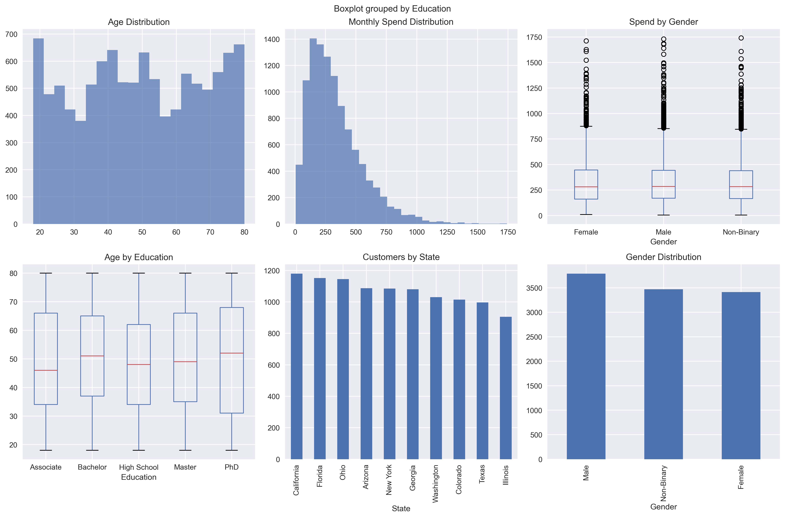

# Customer Insights & Retail Analytics

## Overview

This project analyzes customer data from a mid-sized retail company to understand customer behavior, spending patterns, and engagement levels.

Using statistical analysis and data visualization, the project identifies key customer segments and provides business recommendations to improve customer retention.

## Business Objective

* Understand customer demographics
* Analyze spending behavior
* Identify customer segments
* Discover factors influencing engagement
* Generate data-driven business insights

## Tools Used

* Python
* Pandas
* NumPy
* Matplotlib
* Seaborn
* Statistics

## Key Analysis Performed

✔ Customer Demographic Analysis

✔ Spending Pattern Analysis

✔ Customer Segmentation

✔ Statistical Hypothesis Testing

✔ Correlation Analysis

✔ Data Visualization

## Key Insights

* Customer spending varies significantly across different demographic groups.
* Certain customer segments contribute more to overall revenue.
* Geographic location influences customer engagement levels.
* Spending behavior shows measurable relationships with customer characteristics.

## Business Value

The analysis helps businesses:

* Better understand their customers
* Improve targeted marketing campaigns
* Enhance customer retention strategies
* Make data-driven business decisions

## Dashboard / Visualizations

## Author

Akshat Raghav

Aspiring Data Analyst

Email: [akshatraghav22@zohomail.in](mailto:akshatraghav22@zohomail.in)
GitHub: github.com/akshatraghav22

